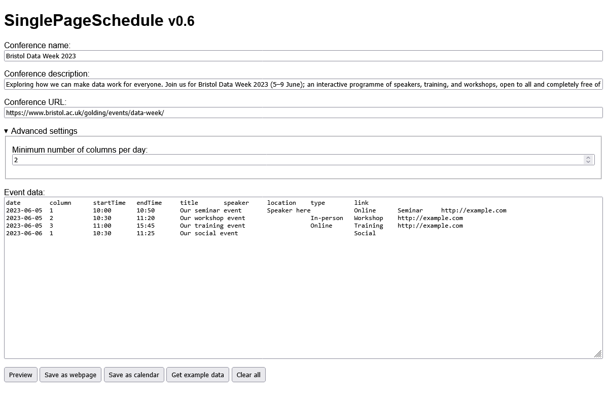
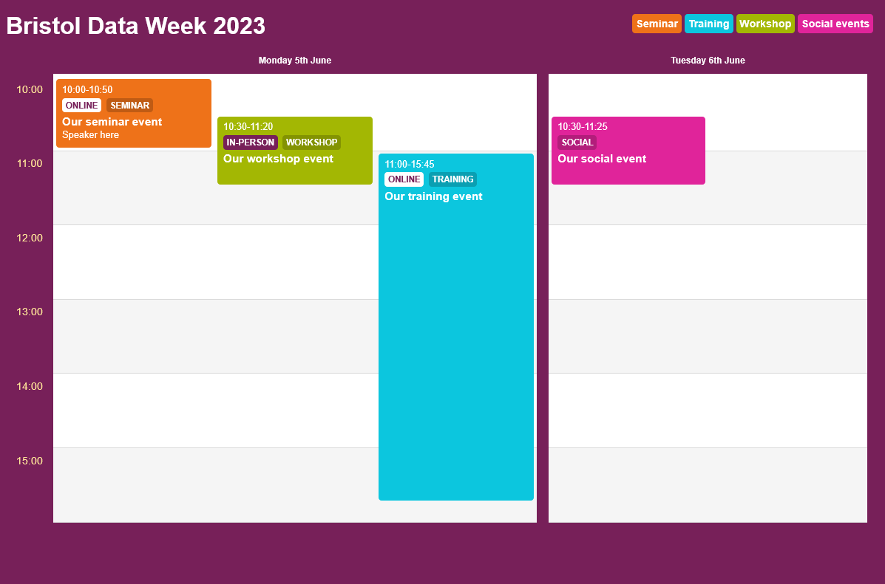

# SinglePageSchedule

In-browser tool to generate a single-page interactive conference schedule and shared calendar, suitable for static hosting.

Screenshot of the editing interface                                          | Screenshot of the output                                             
---------------------------------------------------------------------------- | ----------------------------------------------------------------------
 | 
